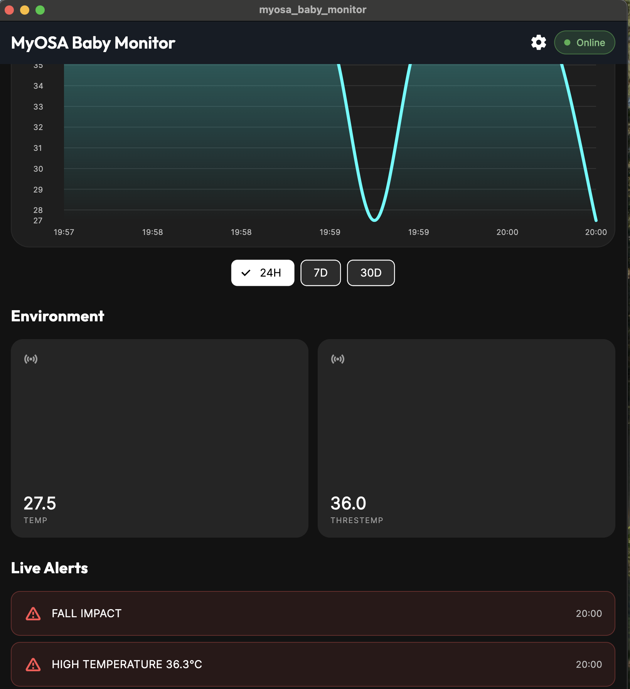

# Smart Wearable for Baby Monitoring 👶🛡️

[](https://github.com/)
[](https://flutter.dev)
[](https://fastapi.tiangolo.com/)
[](https://opensource.org/licenses/MIT)

A real-time guardian for infants powered by an event-driven architecture. This system provides proactive safety monitoring by combining on-device edge computing with a high-speed cloud backend.

## 🙏 Acknowledgements

We would like to thank the **IEEE Sensors Council** for providing the **MYOSA hardware kit** and our faculty mentor for their invaluable guidance on embedded systems integration and sensor fusion algorithms.

## 📖 Overview

Infant safety is a universal concern, but traditional monitors often fail to provide immediate context on physical safety hazards. Most are passive (audio/video only), requiring a parent to be constantly watching or listening.

Our solution is a **Smart Wearable** that tracks environmental parameters and physical safety in real-time. Unlike standard monitors, it runs a custom **fall-detection algorithm** directly on the ESP32 firmware to detect distress states instantly.

### Key Features

* **Algorithmic Fall Detection:** On-device processing of accelerometer and gyroscope data to detect free-fall impacts.
* **Real-Time Telemetry:** Streams sensor data via MQTT for sub-second dashboard updates.
* **Environmental Safety:** Monitors Temperature and Air Quality to predict discomfort.
* **Cross-Platform App:** A Flutter-based mobile dashboard for historical trends and live alerts.

## 📸 Demo / Examples

### Images

<p align="center">
  
  <br>
  <i>The MYOSA-based wearable prototype connected to the sensor array.</i>
</p>

<p align="center">
  
  <br>
  <i>Flutter mobile dashboard showing real-time environmental data and alerts.</i>
</p>

### Videos

1. **Live Prototype Demonstration (3 min)**
<video controls width="100%">
  <source src="/myosa-demo.mp4" type="video/mp4">
</video>

2. **Project Presentation (5 min)**
<video controls width="100%">
  <source src="/myosa-presentation.mp4" type="video/mp4">
</video>

## 🛠️ Features (Detailed)

### 1. Heuristic Fall Detection

Instead of relying on cloud processing which introduces latency, the MYOSA device runs a **C++ based algorithm** locally on the ESP32. It continuously analyzes the 6-axis data from the **MPU6050**.

* **Logic:** The system monitors net acceleration vectors and gyroscopic spikes. If the system detects a free-fall state (low G) followed immediately by a high-G impact and rotation, it triggers a critical "Fall Impact" alert.

### 2. Full-Stack IoT Architecture

* **Device:** ESP32 publishes JSON payloads over secure MQTT.
* **Backend:** A Python FastAPI service ingests data, persists it to a **PostgreSQL** database for historical analysis, and manages alert logic.
* **Frontend:** A **Flutter** app subscribes to live topics for immediate visualization and notification via Provider state management.

### 3. Environmental Monitoring

The device continuously reads from **BMP180** (Barometric Pressure Sensor)
 **MPU6050** 6-Axis Accelerator & Gyroscope Sensors.

* **Dynamic Thresholds:** Users can set custom thresholds (e.g., "Alert if Temp > 38°C") via the mobile app.
* **Over-the-Air Updates:** The app pushes these configuration updates back to the device firmware in real-time via MQTT.

---

## 🚀 Usage Instructions

### 1. Firmware Setup

1. Open the `device/` folder in **PlatformIO** or **Arduino IDE**.
2. Install the required libraries: `Adafruit_MPU6050`, `PubSubClient`, `ArduinoJson`.
3. Update the `ssid` and `password` variables in the code with your Wi-Fi credentials.
4. Flash the code to the ESP32 board.

### 2. Backend Setup

1. Navigate to the `backend/` folder.
2. Start the services using Docker Compose:

   ```bash
   docker-compose up --build
   ```

3. The API will be available at `http://localhost:8001`.

### 3. Mobile App

1. Navigate to the `mobile/` folder.
2. Install dependencies and run the app:

   ```bash
   flutter pub get
   flutter run
   ```

---

## 💻 Tech Stack

* **Hardware:** MYOSA Mini IoT Kit (ESP32)
* **Sensors:**  BMP 180 (Barometric Pressure Sensor), MPU6050 6-Axis Accelerator & Gyroscope Sensor

* **Firmware:** C++ / Arduino Framework
* **Backend:** Python FastAPI, SQLAlchemy, PostgreSQL, Hive (MQTT)
* **Mobile:** Flutter (Dart)

---

## 📦 Requirements / Installation

### Firmware Dependencies

* `WiFiClientSecure`
* `MQTT`
* `ArduinoJson`
* `Wire`

### Backend Dependencies

```bash
pip install fastapi uvicorn sqlalchemy aiomqtt psycopg2-binary
```

---

## 📂 File Structure

```text
/myosa
  ├─ device/               # ESP32 Firmware (C++)
  │   └─ device.ino
  ├─ backend/              # FastAPI & MQTT Logic
  │   └─ app/main.py
  ├─ mobile/               # Flutter Application
  │   └─ lib/main.dart
  ├─ monitor-prototype.jpg # Assets
  ├─ dashboard-screenshot.png
  ├─ myosa-demo.mp4
  └─ myosa-presentation.mp4
```

---

## 📄 License

This project is open-source and available under the **MIT License**.

## 🤝 Contribution Notes

We welcome contributions! Please open an issue if you find bugs in the fall detection algorithm or have suggestions for optimizing the MQTT payload structure.
